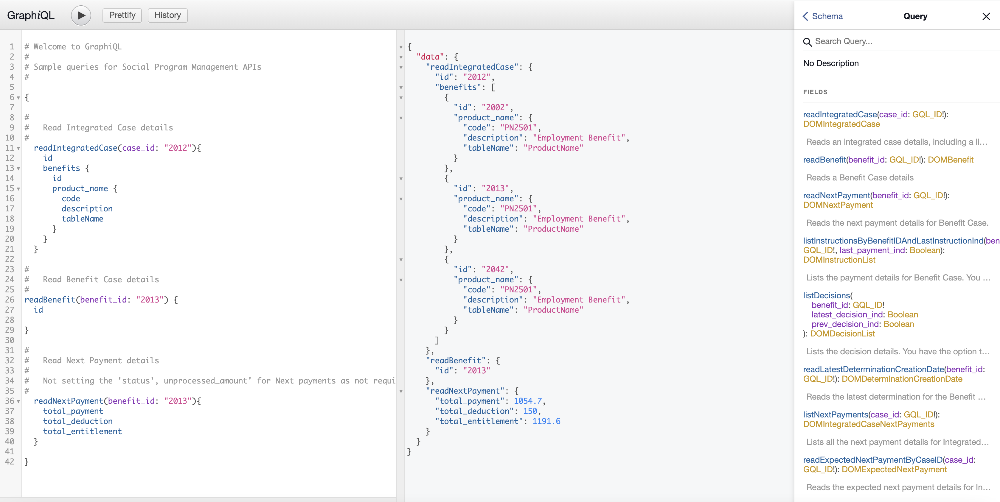

# Testing a GraphQL query by using the GraphiQL IDE

You can use the GraphiQL IDE in a development environment to send a query to test the GraphQL APIs. The application must be running in your development environment on Tomcat.

By default, introspection queries, which are used by the GraphiQL IDE to retrieve the schema details from the GraphQL server, are disabled and must be enabled. For more information, see [Configuring GraphQL properties](../creating/setting_system_properties.md).

The GraphiQL HTML page is not included in the deployed REST ear, so the schema is not exposed in production environments.

The GraphiQL IDE is available at `http://<server>:<port>/Rest/graphql.html`.

The following list outlines how to run a simple query and display the results:

1. From the GraphiQL left pane, start typing the API name that you want to call, for example `readIntegratedCase`. The tool automatically displays a drop-down list of the available APIs for you to choose.
2. Enter the arguments with the value. For example, specify the case identifier and the value for a case to query `case_id: "2012"`.
3. Enter the `{` open brace and click <b>Enter</b>.
4. Enter the attributes that you want to return for your query. The tool assists you with the list of attributes that are available for that API when you start typing.
5. Click the attributes that you want to use.
6. Click the  play button to run the query. The results from the query are displayed in the middle pane. The results are returned in JSON format.

<em> Figure 1. The displayed query results</em>
