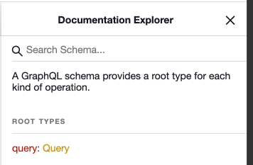
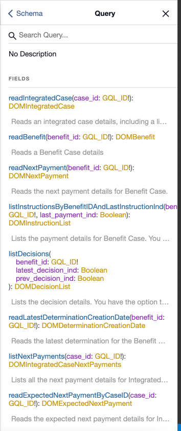

# Viewing the GraphQL queries by using the GraphiQL IDE

GraphQL can process certain queries, called
introspection queries, that return details about the schema.

You can use the GraphiQL IDE in a development environment, which sends an introspection query to the server and displays all the GraphQL APIs
and their corresponding data objects. The application must be running in your development environment on Tomcat.

By default, introspection queries are disabled and must be enabled. For more information, see [Configuring GraphQL properties](../creating/setting_system_properties.md).

The GraphiQL HTML page is not included in the deployed REST ear, so the schema is not exposed in production environments.

## About this task

The GraphiQL IDE is available at `http://<server>:<port>/Rest/graphql.html`.

## Viewing the queries structure

1. From the GraphiQL HTML page, the right side displays the Documentation Explorer for the GraphQL APIs that are available to query.

    

    <em> Figure 1. Documentation Explorer</em>

2. Click on the `Query` root type to view the list of available fields. Click each of the APIs to view the details of the arguments that are being passed in and the type that is being returned.

    

    <em> Figure 2. List of available fields</em>
